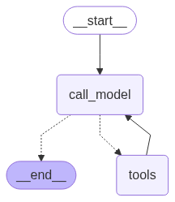

Here’s a **README.md** you can use for your project:

---

# 🧑‍⚕️ Medical Assistant with LangChain, FAISS, Tavily & Azure OpenAI

This project demonstrates how to build a **medical assistant agent** using:

- **LangChain** for LLM orchestration
- **Azure OpenAI** for embeddings & chat models
- **FAISS** for internal document retrieval
- **Tavily Search API** for external web search
- **LangGraph** for tool orchestration with conditional flow

The assistant can answer patient-related queries by combining **internal medical advice documents** with **real-time search results**.

---

## 📦 Installation

Install the required dependencies:

```bash
pip install langchain-openai langchain-community langchain_openai langchain-tavily langgraph faiss-cpu
```

---

## 🔑 Environment Variables

Set your API keys and endpoints before running:

```bash
export AZURE_OPENAI_EMBEDDING_API_KEY="your-embedding-api-key"
export AZURE_OPENAI_EMBEDDING_ENDPOINT="your-embedding-endpoint"
export AZURE_OPENAI_EMBED_MODEL="text-embedding-3-small"

export AZURE_OPENAI_LLM_API_KEY="your-llm-api-key"
export AZURE_OPENAI_LLM_ENDPOINT="your-llm-endpoint"
export AZURE_OPENAI_LLM_MODEL="GPT-4o-mini"

export TAVILY_API_KEY="your-tavily-api-key"
```

> ⚠️ **Important:** Do not hardcode API keys in code (the example does so for demo purposes only). Use environment variables or a secrets manager instead.

---

## 📝 Code Overview

### 1. **Mock Medical Knowledge Base**

The assistant uses mock medical advice chunks stored as `Document` objects (e.g., sore throat, fever, dizziness).

```python
mock_chunks = [
    Document(page_content="Patients with a sore throat should drink warm fluids..."),
    Document(page_content="Mild fevers under 38.5°C can often be managed with rest..."),
    ...
]
```

### 2. **FAISS Retriever**

The mock chunks are embedded with `AzureOpenAIEmbeddings` and stored in a FAISS vector store for similarity search.

### 3. **Custom Tool – `retrieve_advice`**

A LangChain tool that retrieves internal advice from FAISS.

```python
@tool
def retrieve_advice(user_input: str) -> str:
    """Searches internal documents for relevant patient advice."""
    docs = retriever.get_relevant_documents(user_input)
    return "\n".join(doc.page_content for doc in docs)
```

### 4. **External Tool – `TavilySearchResults`**

Allows the agent to query external web search results when needed.

### 5. **LangGraph Orchestration**

The agent is defined as a **graph**:

- `call_model` → Calls the LLM
- `should_continue` → Decides whether to call a tool or stop
- `tools` → Executes either FAISS retrieval or Tavily search

Graph structure:



---

## ▶️ Usage

Run the assistant:

```bash
python main.py
```

Example query:

```text
I feel tired and have a sore throat. What should I do?
```

### Example Output:

```md
Final Response:


1. **Stay Hydrated**: Drink warm fluids, such as herbal tea or broth, which can soothe your sore throat. Avoid cold beverages.

2. **Rest**: Make sure to get enough sleep and rest, as fatigue can be a sign of various issues, including iron deficiency or lack of sleep.

3. **Manage Fever**: If you have a mild fever (under 38.5°C), rest and hydration can help manage it.     

4. **Monitor Symptoms**: If your sore throat persists, or if you develop a persistent cough lasting more than 2 weeks, you should consider seeing a healthcare provider for further evaluation.
```

---

## ⚠️ Disclaimer

This project is for **educational purposes only**.
It is **not** a replacement for professional medical advice, diagnosis, or treatment.
Always consult a qualified healthcare provider for medical concerns.

---

## 📜 License

Apache 2.0 (same as LangChain and Azure OpenAI SDKs).

---

Do you want me to also add a **diagram of the LangGraph workflow (START → LLM → Tool → LLM → END)** inside the README for better visualization?
